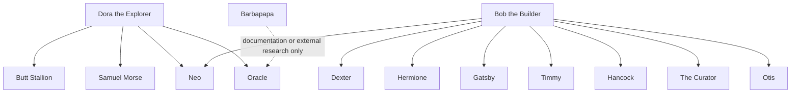
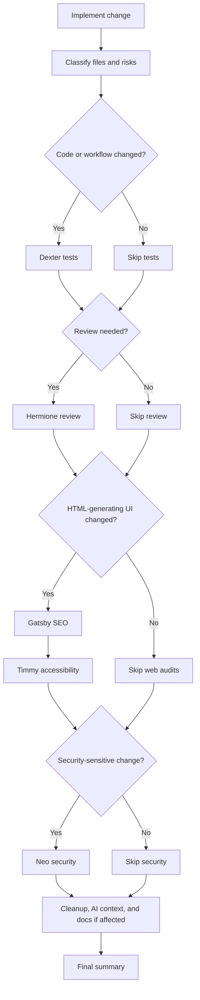

# My OpenCode Agents

This repository contains a small set of OpenCode agent definitions. The OpenCode core is isolated under `agents/`, leaving the repository root for project-level documentation and instructions.

The current agent set uses a cost-aware workflow. Bob the Builder runs only the validation gates that apply to the files changed, while selected audit agents use the lower-cost `opencode/big-pickle` model.

## Agent Relationships

*Figure: Primary agents and the subagents they are expected to call during planning, implementation, validation, or supporting research.*

## Agents

| Agent | Mode | File | Purpose |
|---|---|---|---|
| Barbapapa | Primary | `agents/primary/Barbapapa.md` | Reads UI images or existing HTML/CSS, then generates a reusable `style.css` plus a fixed `demo.html` validation page. |
| Bob the Builder | Primary | `agents/primary/Bob the Builder.md` | Implements approved plans and runs a conditional gated quality pipeline. |
| Dora the Explorer | Primary | `agents/primary/Dora the Explorer.md` | Gathers requirements and writes implementation plans under `plans/` only. |
| Butt Stallion | Subagent | `agents/subagent/Butt Stallion.md` | Generates unconventional ideas during planning. |
| Dexter | Subagent | `agents/subagent/Dexter.md` | Writes or updates tests for modified code. |
| Gatsby | Subagent | `agents/subagent/Gatsby.md` | Audits HTML-generating files for SEO issues using `opencode/big-pickle`; shell access is disabled. |
| Hancock | Subagent | `agents/subagent/Hancock.md` | Finds dead code and handles confirmed safe cleanup. |
| Hermione | Subagent | `agents/subagent/Hermione.md` | Reviews code for correctness, performance, and maintainability. |
| Neo | Subagent | `agents/subagent/Neo.md` | Performs security audits and threat-focused reviews. |
| Oracle | Subagent | `agents/subagent/Oracle.md` | Researches current external documentation and advisories. |
| Otis | Subagent | `agents/subagent/Otis.md` | Writes human-facing documentation using `opencode/big-pickle`; Javadoc/source edits require an explicit Javadoc request. |
| Samuel Morse | Subagent | `agents/subagent/Samuel Morse.md` | Probes real APIs with curl before integration work. |
| The Curator | Subagent | `agents/subagent/The Curator.md` | Maintains AI-facing current-state documentation and agent context files. |
| Timmy | Subagent | `agents/subagent/Timmy.md` | Audits HTML-generating files for accessibility issues using `opencode/big-pickle`; shell access is disabled. |
| Turing | Subagent | `agents/subagent/Turing.md` | Runs numerical calculations and data analysis via Python. |

## Notes

- Agent filenames intentionally include spaces because prompts reference names like `@Bob the Builder` and `@Samuel Morse`.
- Most agents have no internet access; `Oracle` is the dedicated web research agent.
- `Barbapapa` is the dedicated multimodal HTML/CSS generation front door; phase 1 keeps it as a primary agent only. By default it generates `style.css` plus a fixed `demo.html` linked with `<link href="style.css" rel="stylesheet">`, and it adjusts that relative path only when the user explicitly asks for a different file layout. The canonical demo template now lives inside `agents/primary/Barbapapa.md`.
- After changing agent frontmatter, model settings, or tool permissions, quit and restart OpenCode so it reloads the configuration.
- See `AGENTS.md` for repository-specific maintenance instructions.

## Bob's Conditional Pipeline

Bob classifies each implementation before calling subagents. He skips gates that do not apply and reports the skip reason in the final summary.

*Figure: Bob selects validation gates from the changed files and risk profile.*

If a subagent edits source, tests, configuration, dependencies, generated UI, permissions, or agent behavior, Bob treats those edits as a new delta and re-runs the affected gates. Human-facing Markdown-only updates do not trigger this revalidation loop.
