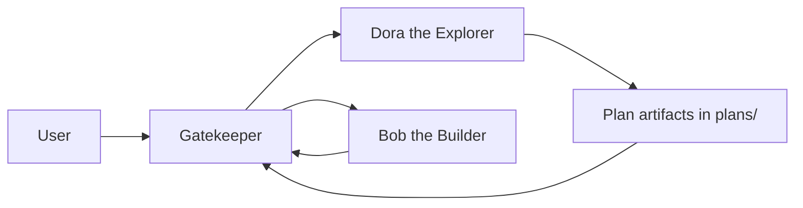

# My OpenCode Agents

This repository contains shared OpenCode agent definitions, a Python LangGraph runtime, and a project template for per-project files.

Use this repository in two layers:

- Install `runtime/` globally on the machine that will run Gatekeeper.
- Keep the shared agent library in `agents/` as the global source of truth.
- Copy `project-template/` into each project that needs local config, overrides, run state, and plan artifacts.

`Gatekeeper` is the main entry point for structured runs. It coordinates planning and implementation, stores runtime state under `.gatekeeper/runs/`, and uses `plans/` plus `plans/runs/` for planning artifacts.

## Agents

| Agent | Mode | File | Purpose |
|---|---|---|---|
| Gatekeeper | Primary | `agents/primary/Gatekeeper.md` | Central workflow orchestrator for structured runs and approval tracking. |
| Bob the Builder | Primary | `agents/primary/Bob the Builder.md` | Implements approved plans and runs the quality pipeline. |
| Dora the Explorer | Primary | `agents/primary/Dora the Explorer.md` | Gathers requirements and writes plan artifacts for Gatekeeper-managed runs. |
| Butt Stallion | Subagent | `agents/subagent/Butt Stallion.md` | Generates unconventional ideas during planning. |
| Dexter | Subagent | `agents/subagent/Dexter.md` | Writes or updates tests for modified code. |
| Gatsby | Subagent | `agents/subagent/Gatsby.md` | Audits HTML-generating files for SEO issues. |
| Hancock | Subagent | `agents/subagent/Hancock.md` | Finds dead code and proposes safe cleanup. |
| Hermione | Subagent | `agents/subagent/Hermione.md` | Reviews code for correctness, performance, and maintainability. |
| Neo | Subagent | `agents/subagent/Neo.md` | Performs security audits and threat-focused reviews. |
| Oracle | Subagent | `agents/subagent/Oracle.md` | Researches current external documentation and advisories. |
| Otis | Subagent | `agents/subagent/Otis.md` | Writes and updates project documentation. |
| Samuel Morse | Subagent | `agents/subagent/Samuel Morse.md` | Probes real APIs with curl before integration work. |
| Timmy | Subagent | `agents/subagent/Timmy.md` | Audits HTML-generating files for accessibility issues. |
| Turing | Subagent | `agents/subagent/Turing.md` | Runs numerical calculations and data analysis via Python. |

## Structured workflow

Use `Gatekeeper` when you want a managed run with planning, approval, and implementation stages.


*Figure: Gatekeeper routes planning through Dora, then sends approved work to Bob.*

- Start structured work with `@Gatekeeper`.
- `Gatekeeper` supervises the V1 workflow over `Dora the Explorer` and `Bob the Builder`.
- `Dora the Explorer` now writes plan artifacts and sends approved work back through `Gatekeeper` instead of routing directly to `Bob the Builder`.
- `Gatekeeper` stores persisted JSON run state under `.gatekeeper/runs/`.
- Planning artifacts remain under `plans/` and `plans/runs/`.

## Repository layout

```text
.
├─ agents/                 # Shared global agent library
├─ runtime/                # Python LangGraph runtime package
└─ project-template/       # Files copied into each user project
```

## Global vs project-local split

This repository separates shared global assets from copied project-local assets.

### Installed globally on the PC
- `runtime/` — the Python LangGraph runtime package intended for global installation
- `agents/` — the shared Markdown agent library used across projects

### Copied into each project
- `project-template/.gatekeeper/gatekeeper.yaml` — per-project runtime config
- `project-template/.gatekeeper/agents/` — optional local overrides for agents
- `project-template/.gatekeeper/runs/` — persisted JSON run state
- `project-template/plans/` and `project-template/plans/runs/` — plan artifacts and run-facing files expected by the prompts

Direct-LLM mode uses runtime-compatible `Dora the Explorer` and `Bob the Builder` overrides from the project template. The shared versions in `agents/` remain the canonical prompts for OpenCode-style authoring.

## Quick start

### 1. Install the runtime

From this repository, install the runtime package:

```bash
pip install ./runtime
```

### 2. Copy the project template into a target project

Copy these directories into the project you want to run:

- `.gatekeeper/`
- `plans/`

### 3. Point the project config at the shared agent library

Set `global_agents_dir` in `.gatekeeper/gatekeeper.yaml` to this repository's `agents/` directory.

### 4. Run tests for the runtime package

The runtime package includes a pytest suite under `runtime/tests/`.

```bash
pytest runtime/tests
```

## Notes

- Agent filenames intentionally include spaces because prompts reference names like `@Bob the Builder` and `@Samuel Morse`.
- Most agents have no internet access; `Oracle` is the dedicated web research agent.
